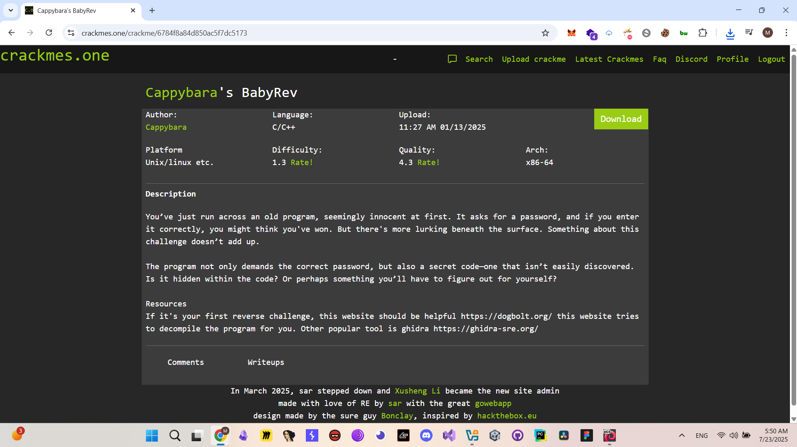
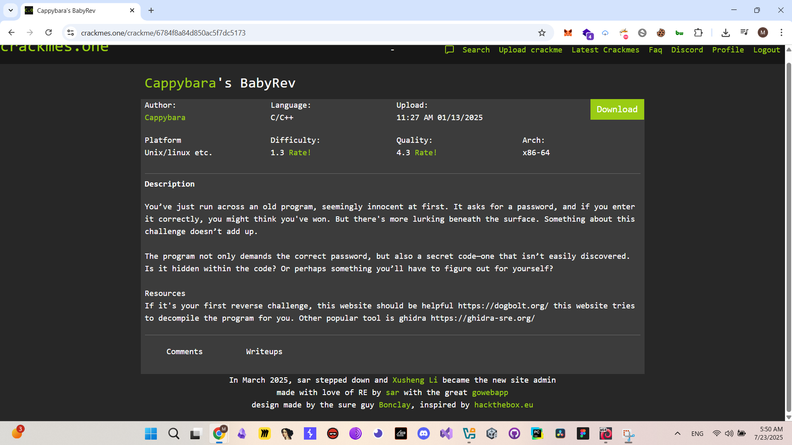
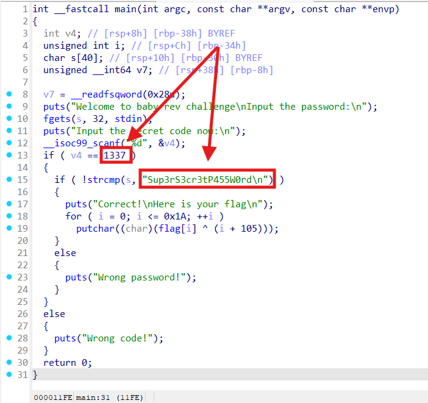
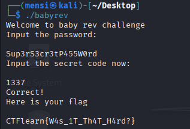

# BabyRev - Writeup

## Description

## Solution

In this challenge i simply opened the binary inside IDA pro and after doing some static analysis i figured out that the binary asks for a password and a secret code which are `Sup3rS3cr3tP455W0rd` and `1337` .

Note : we can use `[https://dogbolt.org/](https://dogbolt.org/)` also for decompilation instead of IDA pro.

After a successfull input we got our flag .

